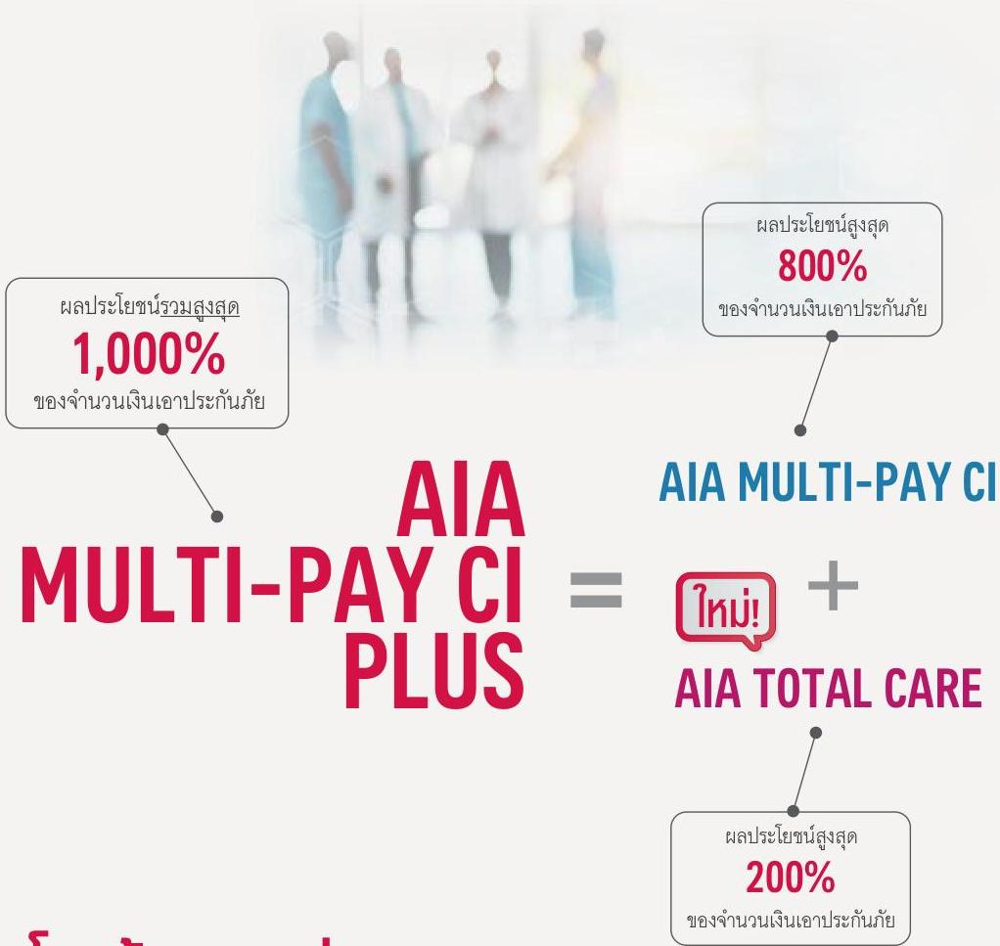
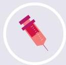
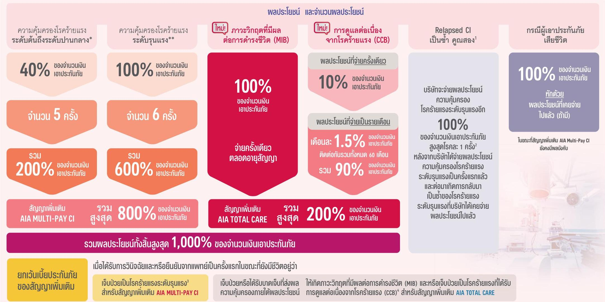
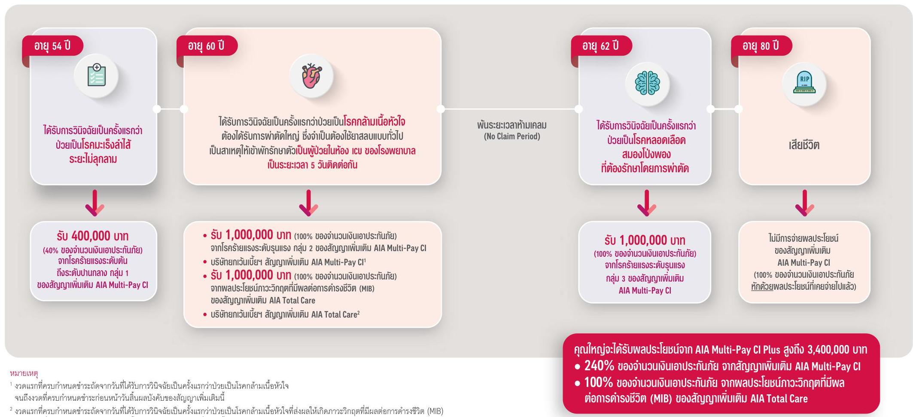
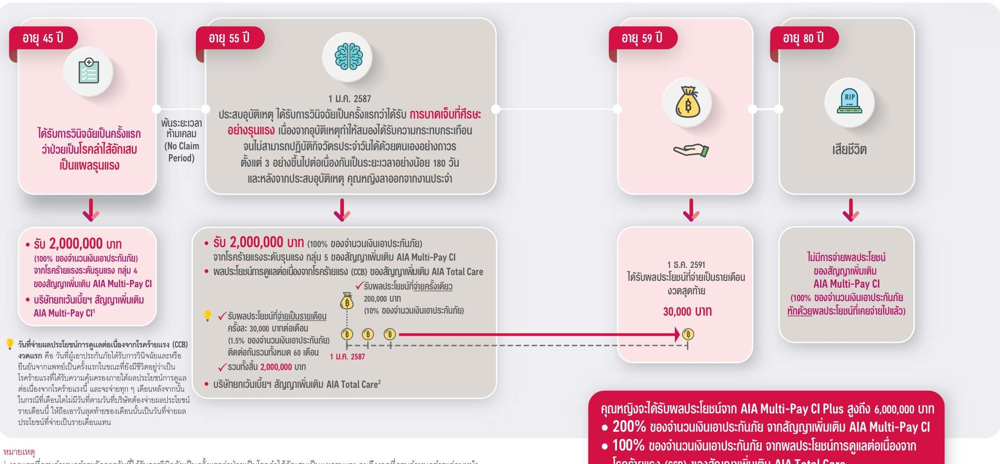
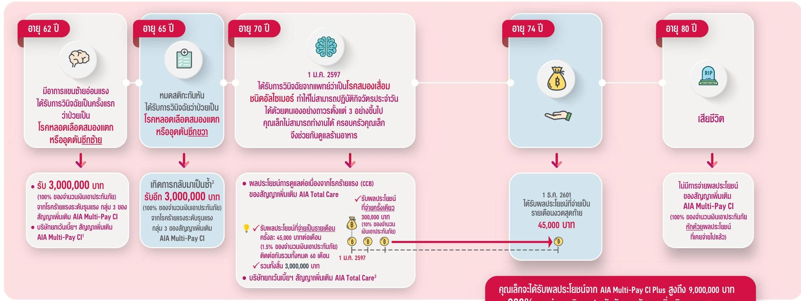

AIA ONE BILLION
เอไอเอ มุ่งสนับสนุนให้ผู้คนกว่าพันล้านคน มีสุขภาพและชีวิตที่ดีขึ้น
AIA
HEALTHIER, LONGER, BETTER LIVES

# AIA MULTI-PAY CI PLUS
(เอไอเอ มัลติเพย์ ซีไอ พลัส)

เอไอเอ มัลติเพย์ ซีไอ พลัส เป็นอีกหลายสนับสนุนที่มีการพันล้าน AIA Multi-Pay CI (เอไอเอ มัลติเพย์ ซีไอ) ควบคู่กับสัญญาเพิ่มเติม AIA Total Care (เอไอเอ โททัล แคร์)

PROTECTION | AIA MULTI-PAY CI PLUS

# โรคภัย เจอ จ่าย หลายจบ ครบถึงการดูแล

- ผู้ขอเอาประกันภัยควรศึกษาและทำความเข้าใจในเอกสารเสนอขายก่อนตัดสินใจทำประกันภัย เมื่อได้รับกรมธรรม์แล้ว โปรดศึกษารายละเอียด ข้อกำหนดและเงื่อนไขในกรมธรรม์
- ผู้ขอเอาประกันภัยมีหน้าที่แถลงข้อความจริงในการขอเอาประกันภัย การปกปิดข้อความจริงหรือแถลงข้อความเท็จใดๆ อาจเป็นเหตุให้บริษัทผู้รับประกันภัยบอกล้างและปฏิเสธไม่จ่ายค่าสินไหมทดแทนตามสัญญาประกันภัย
- ข้อกำหนดและเงื่อนไขของความคุ้มครองจะระบุไว้ในกรมธรรม์ประกันภัยที่ออกให้กับผู้ถือกรมธรรม์

PROTECTION | AIA MULTI-PAY CI PLUS 3

# AIA MULTI-PAY CI PLUS
## คุ้มครองมากกว่าโรคร้ายแรงทั่วไป

ความคุ้มครองโรคร้ายแรงที่ครอบคลุมทุกระดับการเจ็บป่วย ทั้งการเจ็บป่วยรุนแรงจากโรคร้ายแรง และที่ไม่ใช่โรคร้ายแรง รวมถึงโรคอุบัติใหม่ และดูแลคุณไปตลอดแม้ในยามที่เข้าสู่ภาวะฟื้นฟูร่างกาย

**สัญญาเพิ่มเติม**
**AIA MULTI-PAY CI**

**ผลประโยชน์สูงสุด 800%** ของจำนวนเงินเอาประกันภัย¹
- โรคร้ายแรงระดับต้นถึงระดับปานกลาง คุ้มครองสูงสุด 5 ครั้ง
- โรคร้ายแรงระดับรุนแรง คุ้มครองสูงสุด 6 ครั้ง²

**ผลประโยชน์ RELAPSED CI เป็นซ้ำ คุณสอง**
จ่ายผลประโยชน์ซ้ำสำหรับ 3 โรคร้ายแรงระดับรุนแรงที่เป็นสาเหตุหลักของการเสียชีวิตของคนไทย

- โรคมะเร็ง
- ระยะลุกลาม
- กล้ามเนื้อหัวใจตายเฉียบพลัน
- จากการขาดเลือด
- โรคหลอดเลือดสมอง
- แตกหรืออุดตัน

**ผลประโยชน์กรณีเสียชีวิต**

---

**ยกเว้นเบี้ยประกันภัยสัญญาเพิ่มเติม**
โดยเป็นไปตามเงื่อนไขของแต่ละสัญญาเพิ่มเติม

**AIA MULTI-PAY CI**
**AIA TOTAL CARE**

---

**ผลประโยชน์ภาวะวิกฤตที่มีผลต่อการดำรงชีวิต (MIB : Major Impact Benefit)**

**ผลประโยชน์การดูแลต่อเนื่องจากโรคร้ายแรง (CCB : Continuing Care Benefit)**

→ **จ่ายครั้งเดียว และ**
→ **จ่ายเป็นรายเดือน ติดต่อกันรวมทั้งหมด 60 เดือน**

**ใหม่!**
**สัญญาเพิ่มเติม**
**AIA TOTAL CARE**

**รวมผลประโยชน์สูงสุด 200%**
ของจำนวนเงินเอาประกันภัย

---

**หมายเหตุ**

¹ กรณีที่ผู้เอาประกันภัยได้รับการวินิจฉัยและหรือยืนยันจากแพทย์ว่า เจ็บป่วยเป็นโรคร้ายแรงระดับต้นถึงระดับปานกลาง และหรือโรคร้ายแรงระดับรุนแรงตั้งแต่ 2 โรคขึ้นไป จากสาเหตุและหรือเหตุการณ์เดียวกัน บริษัทจะจ่ายผลประโยชน์ความคุ้มครองโรคร้ายแรงที่ได้รับความคุ้มครองภายใต้สัญญาเพิ่มเติมนี้สูงที่สุดเพียง 1 โรคเท่านั้น และให้รวมถึง กรณีดังต่อไปนี้

- กรณีที่ 1 ผลการวินิจฉัย “โรคมะเร็งระยะลุกลาม” และ “โรคมะเร็งระยะไม่ลุกลาม” ระบุว่า เกิดขึ้นที่อวัยวะเดียวกัน ข้างเดียวกัน และได้รับการรักษาหรือผ่าตัดในครั้งเดียวกัน
- กรณีที่ 2 การบาดเจ็บ “แผลไหม้แกรวจ” และ “แผลไหม้ชนิดรุนแรงน้อย” ที่เกิดจากอุบัติเหตุครั้งเดียวกัน
- กรณีที่ 3 การเจ็บป่วยเป็น “โรคน้ำไข่สันหลังคังในโพรงสมองซึ่งเกิดภายหลังและต้องใส่ท่อระบาย” และ “การผ่าตัดฝังท่อระบายในโพรงสมอง” ซึ่งเป็นการรักษาครั้งเดียวกัน
- กรณีที่ 4 “การสูญเสียแขนหรือขาหนึ่งช่วงหรือสาหนึ่งช่วง” และต่อมาผู้เอาประกันภัยได้รับการวินิจฉัยว่าเจ็บป่วยเป็นโรคร้ายแรงระดับรุนแรงดังต่อไปนี้ “อัมพาตของกล้ามเนื้อแขนหรือขา” หรือ “การสูญเสียการดำรงชีวิตอย่างอิสระ” หรือ “การทุพพลภาพถาวรสิ้นเชิง” หรือ “คาบอด” โดยโรคร้ายแรงระดับรุนแรงดังกล่าวเกิดจากสาเหตุเดียวกันกับ “การสูญเสียแขนหรือขาหนึ่งช่วงหรือสาหนึ่งช่วง”

ทั้งนี้ จะถือว่าการจ่ายผลประโยชน์ใน 4 กรณีนี้เป็นการจ่ายผลประโยชน์ความคุ้มครองโรคร้ายแรงระดับรุนแรงในแต่ละกรณีเท่านั้น

² บริษัทจะจ่ายผลประโยชน์ความคุ้มครองโรคร้ายแรงระดับรุนแรงสำหรับ “ภาวะอะแพลติก” หรือ “การสูญเสียการดำรงชีวิตอย่างอิสระ” หรือ “การทุพพลภาพถาวรสิ้นเชิง” เฉพาะกรณีที่ เป็นการจ่ายผลประโยชน์ในครั้งแรก หรือ ที่ผู้เอาประกันภัยได้รับการวินิจฉัยและหรือยืนยันจากแพทย์เป็นครั้งแรกในขณะที่ยังมีชีวิตอยู่ว่าการเจ็บป่วยเป็นโรคร้ายแรงดังกล่าวได้เกิดขึ้นจากอุบัติเหตุ

- ผู้ขอเอาประกันภัยควรศึกษาและทำความเข้าใจในเอกสารเสนอขายก่อนตัดสินใจทำประกันภัย เมื่อได้รับกรมธรรม์แล้ว โปรดศึกษารายละเอียด ข้อกำหนดและเงื่อนไขในกรมธรรม์
- ผู้ขอเอาประกันภัยมีหน้าที่แถลงข้อความจริงในการขอเอาประกันภัย การปกปิดข้อความจริงหรือแถลงข้อความเท็จใด ๆ อาจเป็นเหตุให้บริษัทผู้รับประกันภัยบอกล้างและปฏิเสธ ไม่จ่ายค่าสินไหมทดแทนตามสัญญาประกันภัย
- ข้อกำหนดและเงื่อนไขของความคุ้มครองจะระบุไว้ในกรมธรรม์ประกันภัยที่ออกให้กับผู้ถือกรมธรรม์

PROTECTION | AIA MULTI-PAY CI PLUS

PROTECTION | AIA MULTI-PAY CI PLUS

# ผลประโยชน์โรคร้ายแรง AIA MULTI-PAY CI PLUS

หากผู้เอาประกันภัยได้รับการวินิจฉัยและหรือยืนยันจากแพทย์เป็นครั้งแรกในขณะที่ยังมีชีวิตอยู่ว่าเจ็บป่วยเป็นโรคร้ายแรงที่ได้รับความคุ้มครองภายใต้สัญญาเพิ่มเติม AIA MULTI-PAY CI และหรือเจ็บป่วยหรือได้รับบาดเจ็บที่ส่งผลให้เกิดการวิกฤตที่มีผลต่อการดำรงชีวิต และหรือเจ็บป่วยเป็นโรคร้ายแรงภายใต้ผลประโยชน์การดูแลต่อเนื่องจากโรคร้ายแรงที่ได้รับความคุ้มครองภายใต้สัญญาเพิ่มเติม AIA TOTAL CARE บริษัทจะจ่ายผลประโยชน์ ดังนี้

* บริษัทจะจ่ายผลประโยชน์ให้เพียงครั้งเดียวสำหรับแต่ละกลุ่มโรค และจะไม่จ่ายผลประโยชน์ในกรณีที่บริษัทได้จ่ายผลประโยชน์โรคร้ายแรงระดับรุนแรงในกลุ่มนี้ไปแล้ว
** บริษัทจะจ่ายผลประโยชน์ให้เพียงครั้งเดียวสำหรับแต่ละกลุ่มโรค และจะไม่คุ้มครองการเจ็บป่วยด้วยโรคร้ายแรงระดับต้นถึงระดับปานกลาง หรือโรคร้ายแรงระดับรุนแรงหรือความผิดปกติที่เกิดขึ้นภายใน 1 ปี (No claim period) นับจากวันที่ผู้เอาประกันภัยได้รับการวินิจฉัยและหรือยืนยันจากแพทย์เป็นครั้งแรกในขณะที่มีชีวิตอยู่ว่าเจ็บป่วยเป็นโรคร้ายแรงระดับรุนแรง (ยกเว้นกรณี Relapsed CI)

- ผู้ขอผลประกันภัยควรศึกษาและทำความเข้าใจในเอกสารเสนอขายก่อนตัดสินใจทำประกันภัย เมื่อได้รับการแจ้งร่วมกับ โปรดศึกษาจ่ายต่อเพียง ข้อกำหนดและเงื่อนไขในการแจ้งร่วม
- ผู้ขอผลประกันภัยมีหน้าที่มองเห็นความจริงในการขอผลประกันภัย การปกปิดข้อความจริงหรือแสงหรือความเสียใด ๆ อาจเป็นเหตุให้บริษัทผู้รับประกันภัยมากกว่าและปฏิเสธไม่จ่ายค่าสินโยบายและค่าอยู่นั้นมากที่สุดในการดูแลต่อเนื่องจากโรคร้ายแรง (CCB) ที่ได้ความคุ้มครองตามสัญญาเพิ่มเติมนี้ และเมื่อประกันภัยภูมิคุ้มค่าที่ได้รับยกเว้นคือ เมื่อประกันภัยภูมิที่ควรทำตามสร้างกลุ่มหน้าวันสิ้นและนิดิธของสัญญาเพิ่มเติมนี้
- เมื่อประกันภัยของสัญญาเพิ่มเติม AIA Total Care คาดเดาที่ได้รับการยกเว้นคือ คาดเดาที่ควรทำตามสร้างกลุ่มที่ผู้เอาประกันภัยได้รับการวินิจฉัยและหรือยืนยันจากแพทย์เป็นครั้งแรกในขณะที่ยังมีชีวิตอยู่ว่าเจ็บป่วยหรือได้รับบาดเจ็บที่ส่งผลให้เกิดการวิกฤตที่มีผลต่อการดำรงชีวิต (MIB) และหรือเจ็บป่วยเป็นโรคร้ายแรงที่ได้รับความคุ้มครองภายใต้ผลประโยชน์การดูแลต่อเนื่องจากโรคร้ายแรง (CCB) ที่ได้ความคุ้มครองตามสัญญาเพิ่มเติมนี้ และเมื่อประกันภัยภูมิคุ้มค่าที่ได้รับยกเว้นคือ เมื่อประกันภัยภูมิที่ควรทำตามสร้างกลุ่มหน้าวันสิ้นและนิดิธของสัญญาเพิ่มเติมนี้

PROTECTION | AIA MULTI-PAY CI PLUS

โรคร้ายแรงที่คุ้มครองภายใต้สัญญาเพิ่มเติม AIA MULTI-PAY CI

|  กลุ่มโรคร้ายแรง | โรคร้ายแรงระดับต้นถึงระดับปานกลาง (E) | โรคร้ายแรงระดับรุนแรง (S)  |
| --- | --- | --- |
|  กลุ่ม 1 โรคมะเร็ง
และเนื้องอก | 1.1E โรคมะเร็งระยะไม่ลุกลาม
1.2E การผ่าตัดเนื้องอกต่อเนื่องในลมออด | 1.1S โรคมะเร็งระยะลุกลาม
1.2S เนื้องอกในสมองชนิดที่ไม่ใช่มะเร็ง  |
|  กลุ่ม 2 โรคหัวใจ การหายใจ
และระบบการไหลเวียนโลหิต | 2.1E โรคหลอดเลือดหัวใจคืนที่รักษาด้วยการสวนหลอดเลือดหัวใจ
2.2E การผ่าตัดออกเฉียชันหัวใจ
2.3E การรักษาโรคอื่นหัวใจด้วยการสวนหลอดเลือด
2.4E การรักษาโรคหลอดเลือดแดงใหญ่เอออร์ตา
โดยวิธีใส่สายสวนทางหลอดเลือด หรือภาวะ
การโปร่งพองของหลอดเลือดแดงใหญ่เอออร์ตา
ที่ระดับอาหรับระดับท้อง
2.5E การใส่เครื่องกรองลิ่มเลือดในหลอดเลือดดำใหญ่ | 2.1S กล้ามเนื้อหัวใจตายเฉียบพลันจากการขาดเลือด
2.2S การผ่าตัดเส้นเลือดเลี้ยงกล้ามเนื้อหัวใจ
2.3S โรคกล้ามเนื้อหัวใจ
2.4S การผ่าตัดลิ้นหัวใจโดยวิธีการเปิดหัวใจ
2.5S การผ่าตัดเส้นเลือดแดงใหญ่ เอออร์ตา
2.6S โรคแรงดันในหลอดเลือดแดงปอดสูงแบบปฐมภูมิ
2.7S โรคหลอดลมปอดอุดกั้นเรื้อรังขึ้นรุนแรง / โรคปอดระยะสุดท้าย
2.8S โรคโลหิตจางจากไขกระดูกไม่สร้างเม็ดโลหิต  |
|  กลุ่ม 3 โรคหลอดเลือดสมอง
ระบบประสาท
และกล้ามเนื้อ | 3.1E โรคหลอดเลือดสมองที่ต้องได้รับการผ่าตัดออกหลอดเลือดแดงคาโรติด
3.2E โรคหลอดเลือดสมองที่ต้องได้รับการรักษาโดยวิธีใส่สายสวนเส้นเลือดแดงบริเวณคอ
3.3E โรคหลอดเลือดสมองโปร่งพองที่รักษาโดยใช้พลาสตมานสายสวนทางหลอดเลือด
3.4E การผ่าตัดฝังท่อระบายในโพรงสมอง | 3.1S โรคหลอดเลือดสมองแตกหรืออุดตัน
3.2S โรคหลอดเลือดสมองโปร่งพองที่ต้องรักษาโดยการผ่าตัด
3.3S ภาวะโคม่า
3.4S โรคสมองเสื่อมชนิดอัลไซเมอร์*
3.5S โรคเยื่อหุ้มสมองและไขสันหลังอักเสบจากเชื้อแบคทีเรีย
3.6S สมองอักเสบจากเชื้อไวรัส
3.7S โรคพาร์กินสัน*
3.8S โรคระบบประสาทมัลติเพิล สเคลอโรซิส
3.9S โรคของเซลล์ประสาทควบคุมการเคลื่อนไหว
3.10S ภาวะอะแพลติก
3.11S อัมพาตของกล้ามเนื้อแขนหรือขา
3.12S โรคโปลิโอ
3.13S โรคกล้ามเนื้อเสื่อม  |
|  กลุ่ม 4 โรคอวัยวะ
และระบบการทำงาน
ที่สำคัญของร่างกาย | 4.1E การผ่าตัดคืนออกหนึ่งกลีบ
4.2E การผ่าตัดไตออกหนึ่งข้าง
4.3E การผ่าตัดปอดออกหนึ่งข้าง | 4.1S ตับวาย
4.2S ไตวายเรื้อรัง
4.3S โรคลำไส้อักเสบเป็นแผลรุนแรง
4.4S การผ่าตัดเปลี่ยนอวัยวะหรือ ปลูกถ่ายไขกระดูก
4.5S โรคไวรัสตับอักเสบขึ้นรุนแรง
4.6S ภาวะตับอ่อนอักเสบที่กลับเป็นซ้ำและเรื้อรัง
4.7S ไตอักเสบสูญเสมจากโรคซิสเต็มมิค ลูปัส อิริเธมาโตซัส
4.8S ภาวะข้ออักเสบรูมาตอยดัชนิดรุนแรง  |
|  กลุ่ม 5 ภาวะติดเชื้อ
การบาดเจ็บร้ายแรง
และภาวะทุพพลภาพ | 5.1E แผลไหม้ฉกรรจ์
5.2E การผ่าตัดเลือดคั่งใต้เยื่อหุ้มสมอง
อันเนื่องมาจากอุบัติเหตุ
5.3E การสูญเสียแขนหรือขาหนึ่งข้าง
หรือตาหนึ่งข้าง
5.4E โรคเบาหวานขึ้นจอประสาทตา | 5.1S แผลไหม้ฉกรรจ์
5.2S การบาดเจ็บที่ศีรษะอย่างรุนแรง
5.3S การสูญเสียการดำรงชีพอย่างอิสระ*
5.4S การทุพพลภาพภาวะสิ้นเชิง
- ไม่สามารถปฏิบัติกิจวัตรประจำวันได้ด้วยตนเองอย่างถาวรตั้งแต่ 3 อย่างขึ้นไป
ต่อเนื่องกันเป็นระยะเวลาอย่างน้อย 180 วัน* หรือ
- ไม่สามารถประกอบอาชีพได้ ๆ เพื่อรับค่าลอบแทนหรือกำไรได้ ต่อเนื่องกัน
เป็นระยะเวลาอย่างน้อย 180 วัน (คุ้มครองตั้งแต่อายุ 17 ปีบริบูรณ์จนถึง
ก่อนอายุครบ 70 ปีบริบูรณ์) หรือ
- การสูญเสีย สายตา มือ หรือ เท้า ทั้ง 2 ข้าง หรือสูญเสียมือ 1 ข้างและเท้า
1 ข้าง หรือสูญเสียสายตา 1 ข้างและมือ 1 ข้าง หรือสูญเสียสายตา 1 ข้าง
และเท้า 1 ข้าง*
5.5S ตาบอด
5.6S การฉีกขาดของรากประสาทต้นแขน
5.7S การสูญเสียความสามารถในการพูด
5.8S โรคเนื้อเยื่อพังผืดอักเสบติดเชื้อและเป็นเนื้อตาย
5.9S โรคเท้าช้าง  |
|  กลุ่ม 6 โรคร้ายแรง
สำหรับผู้เชี่ยวชาญ |  | 6.1S โรคไข้รูมาติกที่ทำให้หัวใจผิดปกติ
6.2S โรคคาวาชากีที่ทำให้เกิดโรคแทรกซ้อนของหัวใจ
6.3S โรคเบาหวานชนิดที่หนึ่ง
6.4S โรคน้ำไขสันหลังคั่งในโพรงสมองซึ่งเกิดภายหลังและต้องใส่ท่อระบาย  |

* บริษัทจะจ่ายผลประโยชน์ในข้อนี้ ภายใต้เงื่อนไขว่าวันที่ผู้เอาประกันภัยได้รับการวินิจฉัยและหรือยืนยันจากแพทย์เป็นครั้งแรกในขณะที่ยังมีชีวิตอยู่ว่าการเจ็บป่วยเป็นโรคร้ายแรงนี้ได้เกิดขึ้นครั้งแรกก่อนที่ผู้เอาประกันภัยมีอายุครบ 80 ปีบริบูรณ์
- ผู้ขอเอาประกันภัยควรศึกษาและทำความเข้าใจในเอกสารเสนอขายก่อนตัดสินใจทำประกันภัย เมื่อได้รับกรมธรรม์แล้ว โปรดศึกษารายละเอียด ข้อกำหนดและเงื่อนไขในกรมธรรม์
- ผู้ขอเอาประกันภัยมีหน้าที่แถลงข้อความจริงในการขอเอาประกันภัย การปกปิดข้อความจริงหรือแถลงข้อความเท็จใด ๆ อาจเป็นเหตุให้บริษัทผู้รับประกันภัยบอกล้างและปฏิเสธไม่จ่ายค่าสินไหมทดแทนตามสัญญาประกันภัย
- ข้อกำหนดและเงื่อนไขของความคุ้มครองจะระบุไว้ในกรมธรรม์ประกันภัยที่ออกให้กับผู้ถือกรมธรรม์

PROTECTION | AIA MULTI-PAY CI PLUS 7

# เงื่อนไขผลประโยชน์ภาวะวิกฤตที่มีผลต่อการดำรงชีวิต (MIB) ของสัญญาเพิ่มเติม AIA TOTAL CARE

ผู้เอาประกันภัยต้องเข้ารักษาตัวเป็นผู้ป่วยในห้องพักผู้ป่วยในวิกฤต (ICU) เป็นระยะเวลาอย่างน้อย 5 วันติดต่อกัน อันเนื่องมาจากสาเหตุหรือการรักษาการเจ็บป่วยหรือการบาดเจ็บข้อใดข้อหนึ่งดังต่อไปนี้

1. การผ่าตัดใหญ่ ซึ่งจำเป็นต้องใช้ยาสลบแบบทั่วไป (General Anaesthesia) หรือการใช้ยาระงับความรู้สึกเฉพาะส่วน (Regional Anaesthesia) ทั้งนี้ ไม่รวมถึงการผ่าตัดเพื่อการบริจาคอวัยวะ
2. การใช้เครื่องช่วยหายใจแบบสอดท่อหรือเจาะคอ หรือเครื่องช่วยพยุงการทำงานของหัวใจและปอดเพื่อรักษา หรือประคับประคองภาวะล้มเหลวของการทำงานของระบบหายใจ
3. ภาวะล้มเหลวของอวัยวะที่สำคัญ หมายถึง ภาวะล้มเหลวระยะสุดท้ายซึ่งไม่สามารถฟื้นกลับมาทำหน้าที่ได้ อย่างมีประสิทธิภาพเพียงพอ ด้วยการรักษาและหรือการผ่าตัดที่เป็นไปตามหลักเกณฑ์ทางเวชปฏิบัติมาตรฐาน ปัจจุบันของอวัยวะดังต่อไปนี้

หัวใจ
ปอด
ตับ
โต
หรือ
ตับ
อ่อน

## โรคร้ายแรงที่ได้รับความคุ้มครองภายใต้ผลประโยชน์การดูแลต่อเนื่องจากโรคร้ายแรง (CCB) ของสัญญาเพิ่มเติม AIA TOTAL CARE

### 8 โรคร้ายแรงที่ส่งพลกระทบต่อการดำรงชีพ

1. โรคสมองเสื่อมชนิดอัลไซเมอร์
2. โรคพาร์กินสัน
3. โรคของเซลล์ประสาท ควบคุมการเคลื่อนไหว
4. โรคกล้ามเนื้อเสื่อม

5. ภาวะข้ออักเสบรูมาตอยต่อนิดรุนแรง
6. การบาดเจ็บที่ศีรษะอย่างรุนแรง
7. การสูญเสียการดำรงชีพอย่างอิสระ
8. การทุพพลภาพถาวรสิ้นเชิง

- ไม่สามารถปฏิบัติกิจวัตรประจำวันได้ด้วยตนเองอย่างถาวร ตั้งแต่ 3 อย่างขึ้นไป ต่อเนื่องกันเป็นระยะเวลาอย่างน้อย 180 วัน หรือ
- ไม่สามารถทำงานหรือประกอบอาชีพได้ ๆ เพื่อรับค่าตอบแทน หรือกำไรได้ ต่อเนื่องกันเป็นระยะเวลาอย่างน้อย 180 วัน หรือ
- การสูญเสียสายตา มีอ หรือเท้า ทั้ง 2 ข้าง หรือ สูญเสียมีอ 1 ข้างและเท้า 1 ข้าง หรือ สูญเสียสายตา 1 ข้างและมีอ 1 ข้าง หรือ สูญเสียสายตา 1 ข้างและเท้า 1 ข้าง

- ผู้ขอเอาประกันภัยควรศึกษาและทำความเข้าใจในเอกสารเสนอขายก่อนตัดสินใจทำประกันภัย เมื่อได้รับกรมธรรม์แล้ว โปรดศึกษารายละเอียด ข้อกำหนดและเงื่อนไขในกรมธรรม์
- ผู้ขอเอาประกันภัยมีหน้าที่แถลงข้อความจริงในการขอเอาประกันภัย การปกปิดข้อความจริงหรือแถลงข้อความเท็จใดๆ อาจเป็นเหตุให้บริษัทผู้รับประกันภัยบอกล้างและปฏิเสธไม่จ่ายค่าสินไหมทดแทนตามสัญญาประกันภัย
- ข้อกำหนดและเงื่อนไขของความคุ้มครองจะระบุไว้ในกรมธรรม์ประกันภัยที่ออกให้กับผู้ถือกรมธรรม์

PROTECTION | AIA MULTI-PAY CI PLUS

PROTECTION | AIA MULTI-PAY CI PLUS

# ตัวอย่างการจ่ายผลประโยชน์ของ AIA Multi-Pay CI Plus

- คุณใหญ่ อายุ 45 ปี แต่งงานมีครอบครัวและมีลูกชายที่น่ารัก 2 คน ทำงานในบริษัทเอกชนแห่งหนึ่ง เป็นเสาหลักของครอบครัว ทำทุกอย่าง เพื่อให้ภรรยาและลูกมีชีวิตที่สุขสบาย แต่ก็ยังมีความกังวลเรื่องสุขภาพ ของตนเองว่าหากป่วยหนักจนส่งผลกระทบต่อครอบครัว และความมั่นคงทางการเงินของทั้งครอบครัวก็อาจสั่นคลอนได้

ตัวแทนประกันชีวิตจากเอไอเอจึงนำเสนอสัญญาเพิ่มเติม AIA Multi-Pay CI จำนวนเงินเอาประกันภัย 1,000,000 บาท คู่กับสัญญาเพิ่มเติม AIA Total Care จำนวนเงินเอาประกันภัย 1,000,000 บาท ในรูปแบบ “AIA Multi-Pay CI Plus” ซึ่งจะช่วยให้คุณใหญ่ลดความกังวลหากต้องสูญเสียรายได้ในยามเจ็บป่วย และยังช่วยลดภาระเบี้ยประกันภัยสัญญาเพิ่มเติมได้ หากเจ็บป่วยเป็นโรคหายแรง ตามเงื่อนไขของสัญญาเพิ่มเติม AIA Multi-Pay CI และ สัญญาเพิ่มเติม AIA Total Care

## หมายเหตุ

1. งวดแรกที่ครบกำหนดชำระยังคงวางวันที่ได้รับการวินิจฉัยเป็นครั้งแรกว่าป่วยเป็นโรคกล้ามเนื้อหัวใจ จนถึงงวดที่ครบกำหนดชำระก่อนหน้าวันสิ้นผลบังคับของสัญญาเพิ่มเติมนี้
2. งวดแรกที่ครบกำหนดชำระยังคงวางวันที่ได้รับการวินิจฉัยเป็นครั้งแรกว่าป่วยเป็นโรคกล้ามเนื้อหัวใจที่ส่งผลให้เกิดภาวะวิกฤตที่มีผลต่อการดำรงชีวิต (MIB) จนถึงงวดที่ครบกำหนดชำระก่อนหน้าวันสิ้นผลบังคับของสัญญาเพิ่มเติมนี้

- ผู้ขอเอาประกันภัยควรศึกษาและทำความเข้าใจในเอกสารเสนอขายก่อนตัดสินใจทำประกันภัย เมื่อได้รับกรมธรรม์แล้ว ไปยุคศึกษารายละเอียด ข้อกำหนดและเงื่อนไขในกรมธรรม์
- ผู้ขอเอาประกันภัยมีหน้าที่แถลงข้อความจริงในการขอเอาประกันภัย การปกปิดข้อความจริงหรือแถลงข้อความเก็งใด ๆ อาจเป็นเหตุให้บริษัทผู้รับประกันภัยบอกล้างและปฏิเสธ ไม่จ่ายค่าเงินโดยตลอดเวลาในสัญญาประกันภัย
- ข้อกำหนดและเงื่อนไขของความคุ้มครองจะระบุไว้ในกรมธรรม์ประกันภัยที่ออกให้กับผู้ถือกรมธรรม์

- ผู้ขอเอาประกันภัยควรศึกษาและทำความเข้าใจในเอกสารเสนอขายก่อนตัดสินใจทำประกันภัย เมื่อได้รับกรมธรรม์แล้ว ไปยุคศึกษารายละเอียด ข้อกำหนดและเงื่อนไขในกรมธรรม์
- ผู้ขอเอาประกันภัยมีหน้าที่แถลงข้อความจริงในการขอเอาประกันภัย การปกปิดข้อความจริงหรือแถลงข้อความเก็งใด ๆ อาจเป็นเหตุให้บริษัทผู้รับประกันภัยบอกล้างและปฏิเสธ ไม่จ่ายค่าเงินโดยตลอดเวลาในสัญญาประกันภัย
- ข้อกำหนดและเงื่อนไขของความคุ้มครองจะระบุไว้ในกรมธรรม์ประกันภัยที่ออกให้กับผู้ถือกรมธรรม์

PROTECTION | AIA MULTI-PAY CI PLUS

PROTECTION | AIA MULTI-PAY CI PLUS

# ตัวอย่างการจ่ายผลประโยชน์ของ AIA Multi-Pay CI Plus

- คุณหญิง อายุ 35 ปี สาวโสดผู้มุ่งมั่นกับการทำงานเพื่อไปให้ถึงเป้าหมาย ตามที่วางเอาไว้ ขณะเดียวกันก็รับผิดชอบภาระค่าใช้จ่ายต่าง ๆ ภายในบ้าน และมอบเงินอุปการะให้แก่พ่อแม่ทุกเดือน งานของคุณหญิงต้องเดินทางไป ต่างจังหวัดบ่อย ๆ เธอจึงกังวลว่าหากเจ็บป่วยหรือบาดเจ็บจนไม่สามารถ กลับมาทำงานได้เหมือนเดิม ส่งผลให้ขาดรายได้ ตนเองจะกลายเป็นภาระ ทางการเงินให้กับคนในครอบครัว

ตัวแทนประกันชีวิตจากเอไอเอจึงนำเสนอสัญญาเพิ่มเติม AIA Multi-Pay CI จำนวนเงินเอาประกันภัย 2,000,000 บาท คู่กับสัญญาเพิ่มเติม AIA Total Care จำนวนเงินเอาประกันภัย 2,000,000 บาท ในรูปแบบ “AIA Multi-Pay CI Plus” ที่มอบความคุ้มครองอย่างต่อเนื่อง ทั้งผลประโยชน์ภาวะวิกฤตที่มีผลต่อการ ดำรงชีวิต (MIB) และผลประโยชน์การดูแลต่อเนื่องจากโรคร้ายแรง (CCB) รวมถึงผลประโยชน์ยกเว้นเบี้ยประกันภัยสัญญาเพิ่มเติม แม้ว่าหากป่วยเป็น โรคร้ายแรง ก็ยังมีเงินก้อนช่วยแบ่งเบาภาระที่มาจากการดำรงชีวิต

## หมายเหตุ

1. งวดแรกที่ครบกำหนดชำระยังจากวันที่ได้รับการวินิจฉัยเป็นครั้งแรกว่าป่วยเป็นโรคทำให้อักเสบเป็นแผลรุนแรง จนถึงงวดที่ครบกำหนดชำระก่อนหน้า วันสิ้นผลบังคับของสัญญาเพิ่มเติมนี้
2. งวดแรกที่ครบกำหนดชำระยังจากวันที่ได้รับการวินิจฉัยเป็นครั้งแรกว่าได้รับการบาดเจ็บที่ศีรษะอย่างรุนแรงภายใต้ผลประโยชน์การดูแล ต่อเนื่องจากโรคร้ายแรง (CCB) จนถึงงวดที่ครบกำหนดชำระก่อนหน้าวันสิ้นผลบังคับของสัญญาเพิ่มเติมนี้

- ผู้ขอเอาประกันภัยควรศึกษาและทำความเข้าใจในเอกสารเสนอขายก่อนตัดสินใจทำประกันภัย เมื่อได้รับการแจ้งร่วมส่ง โปรดศึกษารายละเอียด ข้อกำหนดและเงื่อนไขในการแจ้งร่วม
- ผู้ขอเอาประกันภัยมีหน้าที่แถลงข้อความจริงในการขอเอาประกันภัย การปกปิดข้อความจริงหรือแถลงข้อความเท็จใด ๆ อาจเป็นเหตุให้บริษัทผู้รับประกันภัยบอกล้างและปฏิเสธ ไม่จ่ายค่าสินไลมาตลอดเวลาและสัญญาประกันภัย
- ข้อกำหนดและเงื่อนไขของความคุ้มครองของรูปใต้การแจ้งร่วมประกันภัยที่ออกให้กับผู้ถือการแจ้งร่วม

PROTECTION | AIA MULTI-PAY CI PLUS

PROTECTION | AIA MULTI-PAY CI PLUS

13

# ผลประโยชน์การกลับมาเป็นซ้ำของโรคร้ายแรงระดับรุนแรง (RELAPSED CI)

## เป็นซ้ำ คุณสอง จากสัญญาเพิ่มเติม AIA Multi-Pay CI

หลังจากบริษัทได้จ่ายผลประโยชน์ความคุ้มครองโรคร้ายแรงระดับรุนแรงครั้งแรกแล้ว และต่อมาเกิดการกลับมาเป็นซ้ำของโรคร้ายแรงระดับรุนแรงที่บริษัทได้เคยจ่ายผลประโยชน์ไปแล้ว บริษัทจะจ่ายผลประโยชน์ความคุ้มครองโรคร้ายแรงระดับรุนแรงอีก 100% ของจำนวนเงินเอาประกันภัย สูงสุดโรคละ 1 ครั้ง¹ สำหรับโรคร้ายแรงดังต่อไปนี้

โรคมะเร็ง ระยะลุกลาม

### กรณีที่ 1 โรคมะเร็งที่ยังคงอยู่ (Persistent Cancer)

โรคมะเร็งระยะลุกลาม (Invasive Cancer) ที่ยังคงอยู่และยังคงรักษาอย่างต่อเนื่อง โดยไม่พบช่วงเวลาที่มีการหายขาดหรือการสงบ (Remission) ตลอดระยะเวลา 2 ปี นับจากวันที่ได้รับการวินิจฉัยว่าเป็นโรคมะเร็งระยะลุกลาม (Invasive Cancer) ครั้งก่อน

### กรณีที่ 2 โรคมะเร็งระยะแพร่กระจาย (Metastatic Cancer)

โรคมะเร็งระยะลุกลาม (Invasive Cancer) ที่ยังคงอยู่และยังคงรักษาไม่หายอย่างต่อเนื่อง ได้กลายเป็นโรคมะเร็งระยะแพร่กระจายไปยังส่วนอื่นในร่างกาย โดยไม่พบช่วงเวลาที่มีการหายขาดหรือการสงบ (Remission) จนพ้นระยะเวลาอย่างน้อย 2 ปี

### กรณีที่ 3 โรคมะเร็งระยะลุกลามกำเริบ (Recurrence Invasive Cancer)

โรคมะเร็งระยะลุกลาม (Invasive Cancer) มีการกำเริบหรือกลับมาเป็นซ้ำ หลังจากมีการหายขาดหรือการสงบ (Remission) ภายหลัง 2 ปี รวมถึง
- การกำเริบเฉพาะที่ (Local recurrence)
- การกำเริบในบริเวณข้างเคียง (Regional recurrence)
- การกำเริบแบบมีการแพร่กระจาย (Metastatic recurrence)

### กรณีที่ 4 โรคมะเร็งระยะลุกลามชนิดใหม่ (New Primary Invasive Cancer)

โรคมะเร็งระยะลุกลามชนิดใหม่ (New Primary Invasive Cancer) ไม่ได้มีสาเหตุ หรือความเกี่ยวข้องใด ๆ กับโรคมะเร็งระยะลุกลาม (Invasive Cancer) ในครั้งก่อน ที่เกิดขึ้นภายหลัง 2 ปี

**ข้อควรทราบ! การรักษาอย่างต่อเนื่องไม่รวมถึงการรักษาแข็งป้องกันการเจ็บป่วยเป็นโรคมะเร็งระยะช้าเล็กครั้งหนึ่ง เช่น การได้รับอาหารโอกซิเดน (Tamoxifen) หรือ รายยกซิเดน (Raloxifene) เป็นต้น**

**หมายเหตุ**
¹ การจ่ายผลประโยชน์ Relapsed CI แต่ละครั้งจะถูกนับและใช้สิทธิภายใต้จำนวนครั้งสูงสุด (6 ครั้ง) และจะไม่น่าระยะเวลาสำมเคลม (No claim period) มาพิจารณา

- ผู้ขอเอาประกันภัยควรศึกษาและทำความเข้าใจในเอกสารเสนอขายก่อนตัดสินใจทำประกันภัย เมื่อได้รับกรมธรรม์แล้ว โปรดศึกษารายละเอียด ข้อกำหนดและเงื่อนไขในกรมธรรม์
- ผู้ขอเอาประกันภัยมีหน้าที่แถลงข้อความจริงในการขอเอาประกันภัย การปกปิดข้อความจริงหรือแถลงข้อความเชื่อใด ๆ อาจเป็นเหตุให้บริษัทผู้รับประกันภัยบอกล้างและปฏิเสธ ไม่จ่ายค่าสินโยนตลอดเวลาและมีคุณค่าประกันภัย
- ข้อกำหนดและเงื่อนไขของความคุ้มครองจะบุหรี่ในกรมธรรม์ประกันภัยที่ออกให้กับผู้ถือกรมธรรม์

## กลับมาประกันภัยที่มีอุปกรณ์ที่ดีที่สุด

ที่กลับมาเป็นซ้ำ โดยเป็นครั้งใหม่และมีความแตกต่างแยกกันชัดเจนจากการเจ็บป่วย เป็นโรคนี้ในครั้งแรก ซึ่งเกิดขึ้นภายหลัง 1 ปี นับจากวันที่ได้รับการวินิจฉัยว่าเป็น กล้ามเนื้อหัวใจตายเฉียบพลันจากการขาดเลือดครั้งแรก

## โรคหลอดเลือดสมองแตกหรืออุดตัน

ที่กลับมาเป็นซ้ำ โดยเป็นครั้งใหม่และมีความแตกต่างแยกกัน ชัดเจนจากการเจ็บป่วยเป็นโรคนี้ในครั้งแรก ซึ่งเกิดขึ้นภายหลัง 1 ปี นับจากวันที่ได้รับการวินิจฉัยว่าเป็น โรคหลอดเลือดสมองแตก หรืออุดตันครั้งแรก

- ผู้ขอเอาประกันภัยควรศึกษาและทำความเข้าใจในเอกสารเสนอขายก่อนตัดสินใจทำประกันภัย เมื่อได้รับกรมธรรม์แล้ว โปรดศึกษารายละเอียด ข้อกำหนดและเงื่อนไขในกรมธรรม์
- ผู้ขอเอาประกันภัยมีหน้าที่แถลงข้อความจริงในการขอเอาประกันภัย การปกปิดข้อความจริงหรือแถลงข้อความเชื่อใด ๆ อาจเป็นเหตุให้บริษัทผู้รับประกันภัยบอกล้างและปฏิเสธ ไม่จ่ายค่าสินโยนตลอดเวลาและมีคุณค่าประกันภัย
- ข้อกำหนดและเงื่อนไขของความคุ้มครองจะบุหรี่ในกรมธรรม์ประกันภัยที่ออกให้กับผู้ถือกรมธรรม์

14 PROTECTION | AIA MULTI-PAY CI PLUS

PROTECTION | AIA MULTI-PAY CI PLUS 15

# ตัวอย่างการจ่ายผลประโยชน์ของ AIA Multi-Pay CI Plus

- คุณเล็ก อายุ 40 ปี เจ้าของธุรกิจร้านอาหาร เป็นคุณพ่อที่ทำงานหนักเพื่อดูแลทุกคนในครอบครัวให้อยู่สบาย จึงต้องการวางแผนทางการเงินเพื่อรองรับกับความเสี่ยงในอนาคตที่อาจจะเกิดขึ้น โดยที่ครอบครัวยังสามารถใช้ชีวิตต่อไปได้อย่างราบรื่นและมั่นคงหากตนเองล้มป่วย

ตัวแทนประกันชีวิตจากเอไอเอจึงนำเสนอสัญญาเพิ่มเติม AIA Multi-Pay CI จำนวนเงินเอาประกันภัย 3,000,000 บาท คู่กับสัญญาเพิ่มเติม AIA Total Care จำนวนเงินเอาประกันภัย 3,000,000 บาท ในรูปแบบ “AIA Multi-Pay CI Plus” ที่รวมผลประโยชน์เพื่อรับมือกับโรคร้ายแรง และจ่ายซ้ำด้วยผลประโยชน์ Relapsed CI เป็นซ้ำ คูณสอง

## หมายเหตุ

1. ระดมราคีครบกำหนดชำระยังจากวันที่ได้รับการวินิจฉัยเป็นครั้งแรกว่าป่วยเป็นโรคหลอดเลือดสมองแตกหรืออุดตัน จนถึงรวดที่ครบกำหนดชำระก่อนหน้า วันสิ้นผลบังคับของสัญญาเพิ่มเติมนี้
2. โรคหลอดเลือดสมองแตกหรืออุดตันซ้ำในครั้งนี้เป็นครั้งใหม่และมีความแตกต่างแยกกันชัดเจนจากการเจ็บป่วยเป็นโรคหลอดเลือดสมองแตกหรืออุดตัน ในครั้งแรกที่บริษัทได้เคยจ่ายผลประโยชน์ไปแล้ว และจะต้องเกิดขึ้นภายหลัง 1 ปี นับจากวันที่ได้รับการวินิจฉัยว่าเป็นโรคหลอดเลือดสมองแตกหรืออุดตัน ครั้งก่อน
3. ระดมราคีครบกำหนดชำระยังจากวันที่ได้รับการวินิจฉัยเป็นครั้งแรกว่าป่วยเป็นโรคสมองเสื่อมชนิดอัลไซเมอร์ภายใต้ผลประโยชน์การดูแลต่อเนื่องจาก โรคร้ายแรง (CCB) จนถึงรวดที่ครบกำหนดชำระก่อนหน้าวันสิ้นผลบังคับของสัญญาเพิ่มเติมนี้

- ผู้ขอเอาประกันภัยควรศึกษาและทำความเข้าใจในเอกสารเสนอขายก่อนตัดสินใจทำประกันภัย เมื่อได้รับกรมธรรม์แล้ว โปรดศึกษารายละเอียด ข้อกำหนดและเงื่อนไขในกรมธรรม์
- ผู้ขอเอาประกันภัยมีหน้าที่แถลงข้อความจริงในการขอเอาประกันภัย การปกปิดข้อความจริงหรือแถลงข้อความเชื่อได้ ๆ อาจเป็นเหตุให้บริษัทผู้รับประกันภัยบอกล้างและปฏิเสธ ไม่จ่ายค่าสินไหมตลอดเวลาแล้วกฎมาประกันภัย
- ข้อกำหนดและเงื่อนไขของความคุ้มครองจะระบุไว้ในกรมธรรม์ประกันภัยที่ออกให้กับผู้ถือกรมธรรม์

## กรุณเล็กจะได้รับผลประโยชน์จาก AIA Multi-Pay CI Plus สูงถึง 9,000,000 บาท

- 200% ของจำนวนเงินเอาประกันภัย จากสัญญาเพิ่มเติม AIA Multi-Pay CI
- 100% ของจำนวนเงินเอาประกันภัย คู่ขอความคุ้มครองในกรมธรรม์

## ที่จะจ่ายได้

- ผู้ขอเอาประกันภัยควรศึกษาและทำความเข้าใจในเอกสารเสนอขายก่อนตัดสินใจทำประกันภัย เมื่อได้รับกรมธรรม์แล้ว โปรดศึกษารายละเอียด ข้อกำหนดและเงื่อนไขในกรมธรรม์
- ผู้ขอเอาประกันภัยมีหน้าที่แถลงข้อความจริงในการขอเอาประกันภัย การปกปิดข้อความจริงหรือแถลงข้อความเชื่อได้ ๆ อาจเป็นเหตุให้บริษัทผู้รับประกันภัยบอกล้างและปฏิเสธ ไม่จ่ายค่าสินไหมตลอดเวลาแล้วกฎมาประกันภัย
- ข้อกำหนดและเงื่อนไขของความคุ้มครองจะระบุไว้ในกรมธรรม์ประกันภัยที่ออกให้กับผู้ถือกรมธรรม์

18 PROTECTION | AIA MULTI-PAY CI PLUS

## ระยะเวลาที่ไม่คุ้มครอง (Waiting Period)

### สัญญาเพิ่มเติม
**เอไอเอ มัลติเพย์ ซีไอ**
**(AIA Multi-Pay CI)**

บริษัทจะไม่คุ้มครองการเจ็บป่วยด้วยโรคร้ายแรงที่เกิดขึ้นภายใน 60 วัน นับแต่วันเริ่มมีผลคุ้มครองตามสัญญาเพิ่มเติมนี้ หรือหากมีการต่ออายุสัญญาเมื่อสัญญาเพิ่มเติมสิ้นผลบังคับ (Reinstatement) ให้นับแต่วันเริ่มมีผลคุ้มครองตามการต่ออายุครั้งสุดท้ายหรือวันที่บริษัทอนุมัติให้เพิ่มจำนวนเงินเอาประกันภัยของสัญญาเพิ่มเติมนี้ แล้วแต่วันใดจะเกิดขึ้นภายหลัง

### สัญญาเพิ่มเติม
**เอไอเอ โททัล แคร์**
**(AIA Total Care)**

บริษัทจะไม่คุ้มครองการเจ็บป่วยหรือได้รับบาดเจ็บที่ส่งผลให้เกิดภาวะวิกฤตที่มีผลต่อการดำรงชีวิตและหรือเจ็บป่วยเป็นโรคร้ายแรงภายใต้ผลประโยชน์การดูแลต่อเนื่องจากโรคร้ายแรงที่เกิดขึ้นภายใน 60 วันนับแต่วันเริ่มมีผลคุ้มครองตามสัญญาเพิ่มเติมนี้หรือหากมีการต่ออายุสัญญาเมื่อสัญญาเพิ่มเติมสิ้นผลบังคับ (Reinstatement) ให้นับแต่วันเริ่มมีผลคุ้มครองตามการต่ออายุครั้งสุดท้ายหรือวันที่บริษัทอนุมัติให้เพิ่มจำนวนเงินเอาประกันภัยของสัญญาเพิ่มเติมนี้ แล้วแต่วันใดจะเกิดขึ้นภายหลัง

## ข้อยกเว้นบางส่วนของสัญญาเพิ่มเติม AIA Multi-Pay CI และสัญญาเพิ่มเติม AIA Total Care

1. ความผิดปกติซึ่งแพทย์ยืนยันและมีหลักฐานชัดเจนว่าเกี่ยวข้องกับโรคร้ายแรงหรือโรคร้ายแรงที่เกิดขึ้นก่อนวันเริ่มมีผลคุ้มครองตามสัญญาเพิ่มเติมนี้
2. การฆ่าตัวตาย หรือการทำร้ายร่างกายตนเอง หรือพยายามกระทำเช่นว่านั้น
3. การติดเชื้อไวรัสภูมิคุ้มกันบกพร่อง (HIV Positive) หรือภาวะของโรคภูมิคุ้มกันบกพร่อง (AIDS) ของผู้เอาประกันภัย ไม่ว่าจะทางตรงหรือทางอ้อมก็ตาม

- ผู้ขอเอาประกันภัยควรศึกษาและทำความเข้าใจในเอกสารเสนอขายก่อนตัดสินใจทำประกันภัย เมื่อได้รับกรมธรรม์แล้ว โปรดศึกษารายละเอียด ข้อกำหนดและเงื่อนไขในกรมธรรม์
- ผู้ขอเอาประกันภัยมีหน้าที่แถลงข้อความจริงในการขอเอาประกันภัย การปกปิดข้อความจริงหรือแถลงข้อความเท็จใด ๆ อาจเป็นเหตุให้บริษัทผู้รับประกันภัยบอกล้างและปฏิเสธไม่จ่ายค่าสินไหมทดแทนตามสัญญาประกันภัย
- ข้อกำหนดและเงื่อนไขของความคุ้มครองจะระบุไว้ในกรมธรรม์ประกันภัยที่ออกให้กับผู้ถือกรมธรรม์

PROTECTION | AIA MULTI-PAY CI PLUS 19

# เงื่อนไขการรับประกันภัยโดยย่อ

|  AIA Multi-Pay CI Plus | เอไอเอ มัลติเพย์ ซีไอ พลัส เป็นชื่อทางการตลาดของ
สัญญาเพิ่มเติม AIA Multi-Pay CI (เอไอเอ มัลติเพย์ ซีไอ) คู่กับ
สัญญาเพิ่มเติม AIA Total Care (เอไอเอ โททัล แคร์)  |
| --- | --- |
|  อายุที่รับประกันภัย | อายุ 15 วัน – 70 ปี ต่ออายุได้ถึงอายุ 98 ปี  |   |   |
| --- | --- | --- | --- |
|  ระยะเวลาคุ้มครอง | สัญญาเพิ่มเติม
เอไอเอ มัลติเพย์ ซีไอ
(AIA Multi-Pay CI) | สัญญาเพิ่มเติม เอไอเอ โททัล แคร์
(AIA Total Care)  |   |
| --- | --- | --- | --- |
|   |  คุ้มครองถึงวันครบรอบปี
ของกรมธรรม์ประกันภัย
ที่ผู้เอาประกันภัยมีอายุ
ครบ 99 ปี
หรือจนกระทั่งแบบ
ประกันภัยหลัก
สิ้นผลบังคับ | ผลประโยชน์การดูแลต่อเนื่อง
จากโรคร้ายแรง
(CCB : Continuing Care Benefit) | ผลประโยชน์การดูแลต่อเนื่อง
จากโรคร้ายแรง
(CCB : Continuing Care Benefit)  |
|   |   |  คุ้มครองถึงวันครบรอบปี
ของกรมธรรม์ประกันภัย
ที่ผู้เอาประกันภัย
มีอายุครบ 99 ปี
หรือจนกระทั่ง
แบบประกันภัยหลัก
สิ้นผลบังคับ | คุ้มครองถึงก่อนวัน
ครบรอบปีกรมธรรม์
ภายหลังผู้เอาประกันภัย
มีอายุครบ 80 ปีบริบูรณ์
หรือจนกระทั่ง
แบบประกันภัยหลัก
สิ้นผลบังคับ  |
|  จำนวนเงินเอาประกันภัยสูงสุด
ที่ซื้อได้ต่อรายชีวิต | ขึ้นอยู่กับกฎเกณฑ์การพิจารณาของบริษัท นับรวมภายใต้จำนวนเงินเอาประกันภัย
สูงสุดของวงเงินโรคร้ายแรงทั้งหมดไม่เกิน 50 ล้านบาท  |
| --- | --- |
|  การพิจารณารับประกันภัย | ขึ้นอยู่กับกฎเกณฑ์การพิจารณาของบริษัท  |
| --- | --- |
|  การตรวจสอบภาค | ขึ้นอยู่กับกฎเกณฑ์การพิจารณาของบริษัท  |
| --- | --- |
|  สิทธิในการลดหย่อนภาษี | เบี้ยประกันภัยสุขภาพ (ถ้ามี) เฉพาะส่วนที่เข้าเงื่อนไขสามารถหักลดหย่อน
ภาษีเงินได้บุคคลธรรมดาตามหลักเกณฑ์ที่กรมสรรพากรกำหนด  |
| --- | --- |
|  สิทธิประโยชน์ AIA VITALITY¹ | สัญญาเพิ่มเติม AIA Multi-Pay CI และสัญญาเพิ่มเติม AIA Total Care
เป็นแบบประกันภัยที่เข้าร่วมโครงการ AIA Vitality และได้รับส่วนลดเบี้ยประกันภัย
ตามเงื่อนไขของโครงการ AIA Vitality  |
| --- | --- |
|  สิทธิประโยชน์ บริการจัดการ
ดูแลผู้ป่วยรายบุคคล² | เมื่อมีความคุ้มครองโรคร้ายแรงที่มีจำนวนเงินเอาประกันภัยรวมต่อรายชีวิตตั้งแต่
3 ล้านบาทขึ้นไป (AIA Multi-Pay CI Plus นับเฉพาะจำนวนเงินเอาประกันภัยของสัญญาเพิ่มเติม
AIA Multi-Pay CI เท่านั้น ไม่นับรวมวงเงินของสัญญาเพิ่มเติม AIA Total Care)  |
| --- | --- |

**หมายเหตุ : ¹ สิทธิประโยชน์ของสมาชิกเอไอเอ ไวทัลลิตี้เป็นไปตามข้อกำหนดและเงื่อนไขของเอไอเอ ซึ่งเอไอเอของกรมสิทธิ์ในการเปลี่ยนแปลง แก้ไข ข้อกำหนดและเงื่อนไขต่าง ๆ โดยท่านสามารถตรวจสอบเพิ่มเติมได้ที่แอปพลิเคชัน AIA+ หรือเว็บไซต์ https://www.aia.co.th/th/health-wellness/vitality/rewards ² - บริการจัดการดูแลผู้ป่วยรายบุคคล (Personal Medical Case Management) เป็นสิทธิพิเศษที่เอไอเอมอบให้กับลูกค้าคนสำคัญที่มีความคุ้มครองกรมธรรม์ตามแผนที่ระบุไว้เท่านั้น กรมธรรม์ของลูกค้าจะต้องมีผลบังคับ ณ วันที่ลงทะเบียนรับสิทธิ เอไอเอและ Teladoc Health จะเป็นผู้ประเมินสิทธิในการรับบริการ โดยสิทธิในการรับบริการเป็นไปตามเงื่อนไขที่เอไอเอ และ Teladoc Health กำหนด  - Teladoc Health เป็นบริษัทที่มีความเป็นอิสระจากเอไอเอ เอไอเอไม่มีความเกี่ยวข้องกับ Teladoc Health ในแง่ของการถือหุ้นและผู้บริหาร และไม่มีส่วนเกี่ยวข้องกับการดำเนินธุรกิจใดๆ ของ Teladoc Health ความพยายามในการชักชวนให้ใช้บริการหรือผลิตภัณฑ์ด้านสุขภาพโดย Teladoc Health ไม่ได้เป็นการขายหรือนำเสนอโดยเอไอเอ เอไอเอจะไม่รับผิดชอบต่อบริการหรือผลิตภัณฑ์ด้านสุขภาพใดๆ ดังกล่าว

- ผู้ขอเอาประกันภัยควรศึกษาและทำความเข้าใจในเอกสารเสนอขายก่อนตัดสินใจทำประกันภัย เมื่อได้รับกรมธรรม์แล้ว โปรดศึกษารายละเอียด ข้อกำหนดและเงื่อนไขในกรมธรรม์  - ผู้ขอเอาประกันภัยมีหน้าที่แถลงข้อความจริงในการขอเอาประกันภัย การปกปิดข้อความจริงหรือแถลงข้อความเท็จใด ๆ อาจเป็นเหตุให้บริษัทผู้รับประกันภัยบอกล้างและปฏิเสธไม่จ่ายค่าสินไหมทดแทนตามสัญญาประกันภัย  - ข้อกำหนดและเงื่อนไขของความคุ้มครองจะระบุไว้ในกรมธรรม์ประกันภัยที่ออกให้กับผู้ถือกรมธรรม์

การชำระเบี้ยประกันภัยเป็นหน้าที่ของผู้ขอเอาประกันภัย การที่ตัวแทนประกันชีวิตมาเก็บเบี้ยประกันภัย เป็นเพียงการให้บริการเท่านั้น

การทำประกันชีวิตไม่ใช่การฝากเงินและมีข้อจำกัดในการเวนคืนกรมธรรม์ ซึ่งการเวนคืนกรมธรรม์ อาจทำให้ผู้เอาประกันภัยได้รับเงินน้อยกว่าเบี้ยประกันภัยที่ชำระมาแล้ว

เกี่ยวกับ เอไอเอ ประเทศไทย
เอไอเอ ประเทศไทย ดำเนินธุรกิจประกันชีวิตตั้งแต่วันที่ 1 ตุลาคม 2481 และเป็นหนึ่งในสมาชิกของกลุ่มบริษัทเอไอเอ โดยให้ความคุ้มครองในด้านการประกันชีวิต การวางแผนออมเงินเพื่อวัยเกษียณ การประกันอุบัติเหตุและสุขภาพ และ การประกันชีวิตควบการลงทุน นอกจากนี้ยังให้บริการแก่ลูกค้าองค์กรในด้านการประกันภัยกลุ่ม ประกันสินเชื่อและเป็น ผู้จัดการกองทุนสำรองเลี้ยงชีพ

เอไอเอ ประเทศไทย
181 ถนนสุรวงศ์ เขตบางรัก กรุงเทพฯ 10500
aia.co.th

SU0215449 – 01/12/2023

