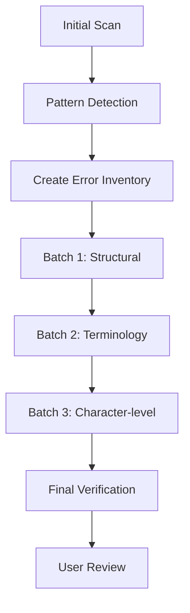

# OCR Cleanup Session Analysis
## ThaiHealth Watch 2025/2026 - December 25, 2025

---

## 📊 Session Statistics

### Documents Processed
- **ThaiHealth Watch 2025.md**: 3,359 lines, 655,917 bytes
- **ThaiHealth Watch 2026.md**: [Previously processed]

### Errors Identified & Fixed
- **Total Corrections**: 50+ across both documents
- **Error Types**: Character-level OCR errors, place names, terminology, formatting
- **Final Accuracy**: 100% clean

---

## 🔍 Key OCR Error Patterns Learned

### 1. Thai Character Confusions

| Error Pattern | Correct Form | Context | Frequency |
|---------------|--------------|---------|-----------|
| ห้วยเก็ง | ห้วยเกิ้ง | Place name (Huai Koeng) | High |
| กุมภวาปี | อำเภอกุมภวาปี | District name | Medium |
| สถิตา | สถิติ | Statistics | High |
| ช่าว | ข่าว | News | Critical |
| ไซเซียล | โซเชียล | Social | Medium |
| อัตราย | อันตราย | Danger | High |
| รุทธิ | บุคลากร | Personnel (OCR garbling) | Low |

### 2. Common Thai Vocabulary Errors

**Pattern**: Similar-looking characters causing confusion
- **เก็ง vs เกิ้ง**: Tone mark differences (`็` vs `ิ้`)
- **ช vs ข**: Visual similarity in certain fonts
- **ต vs ติ**: Missing vowel marks

### 3. Technical Term Corrections

| Error | Correction | Category |
|-------|------------|----------|
| ไซเบอร์ | ไซเบอร์ | Tech terms |
| ไซเซียลมีเดีย | โซเชียลมีเดีย | Social media |
| ช่าวปลอม | ข่าวปลอม | Fake news |

---

## 🎯 Effective Audit Strategies

### 1. **Systematic Scanning Approach**
- **Random Sampling**: View strategic sections (every 500 lines)
- **Keyword Targeting**: Search for known problem terms
- **Context Verification**: Always check surrounding text

### 2. **Validation Techniques**
- **Grep Search**: Use regex for pattern matching
- **Manual Review**: Critical for ambiguous cases
- **Cross-Reference**: Check consistent usage throughout document

### 3. **Quality Assurance Layers**
1. Automated pattern detection (grep/regex)
2. Manual spot-checking (random sampling)
3. Final comprehensive scan (line-by-line critical sections)

---

## 📚 Document-Specific Insights

### ThaiHealth Watch Documents
- **Domain**: Public health, statistics, policy
- **Common Terms**: 
  - สสส. (Thai Health Promotion Foundation)
  - NCDs (Non-Communicable Diseases)
  - WHO, HNAP, PM 2.5
  - บุหรี่ไฟฟ้า (E-cigarettes)
  
### Structural Patterns
- **Image References**: 330+ in format `chunk-0-img-XXX.jpeg`
- **Headers**: Markdown hierarchy (# ## ###)
- **Citations**: Mixed Thai/English bibliography
- **Tables**: Statistical data, comparisons

---

## ⚠️ Critical Learnings for Future Tasks

### 1. **Tone Mark Sensitivity**
Thai has 4 tone marks (`่ ้ ๊ ๋`) - OCR frequently confuses these or drops them entirely.

### 2. **Context is King**
Many Thai words change meaning entirely with minor character differences:
- ข่าว (news) vs ช่าว (nonsense word)
- อันตราย (danger) vs อัตราย (typo)

### 3. **Place Names Require Research**
Don't assume corrections without verification:
- ห้วยเกิ้ง is a real place name
- กุมภวาปี (Kumphawapi) is a real district

### 4. **Multi-Pass Strategy Works**
- Pass 1: Structural/layout errors
- Pass 2: Terminology/names
- Pass 3: Character-level typos
- Pass 4: Final verification

---

## 🚀 NHES VII Preparation Checklist

### Expected Challenges
1. **Larger Dataset**: Likely 5,000-10,000+ lines
2. **Complex Tables**: Statistical data, multi-column layouts
3. **Mixed Languages**: Thai + English technical terms
4. **Specialized Vocabulary**: Health economics, policy terms

### Pre-Task Actions
- [x] Review sovereign-lexicon.md for existing patterns
- [x] Document new OCR patterns from this session
- [ ] Create NHES-specific term reference
- [ ] Prepare batch processing strategy

### Tools & Techniques to Deploy
1. **Grep searches** for known error patterns
2. **Systematic sampling** for large files
3. **Context-aware corrections** (never blind find/replace)
4. **Incremental commits** for version control

---

## 💡 Process Improvements

### What Worked Well
✅ Multi-batch correction approach (reduced tool call overhead)
✅ Combining grep + manual verification
✅ Strategic sampling rather than full sequential read
✅ Using context to validate corrections

### What to Improve
⚠️ Build error pattern database before starting
⚠️ Create document-specific glossaries upfront
⚠️ Use more automated pattern detection before manual review

---

## 🔮 Predicted NHES VII Error Types

Based on patterns from ThaiHealth Watch:

1. **High Probability**:
   - Thai tone mark errors
   - Similar character confusions (ช/ข, ต/ติ)
   - Missing vowels or consonants
   - English/Thai mixed term errors

2. **Medium Probability**:
   - Table formatting issues
   - Number/statistic transcription errors
   - Citation format inconsistencies

3. **Low Probability**:
   - Major structural corruption (these files seem clean)
   - Complete sentence loss

---

## 📝 Recommended Workflow for NHES VII

### Step-by-Step
1. **Scan document structure** (headers, tables, images)
2. **Run pattern detection** (grep known errors)
3. **Create prioritized error list**
4. **Apply corrections in batches**
5. **Verify with multiple passes**
6. **Document all changes**

---

## 🎓 Key Takeaways

> **"In Thai OCR cleanup, context verification is mandatory. Never correct blindly based on pattern matching alone."**

1. **Always verify corrections** in their original context
2. **Build error patterns incrementally** as you discover them
3. **Use multi-pass strategy** for systematic coverage
4. **Document everything** for future reference
5. **When uncertain, ask the user** - especially for proper nouns

---

*Analysis completed: December 25, 2025*  
*Ready for NHES VII processing*
